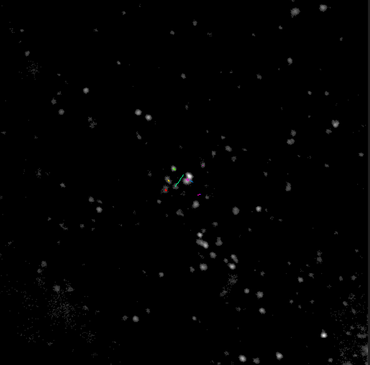
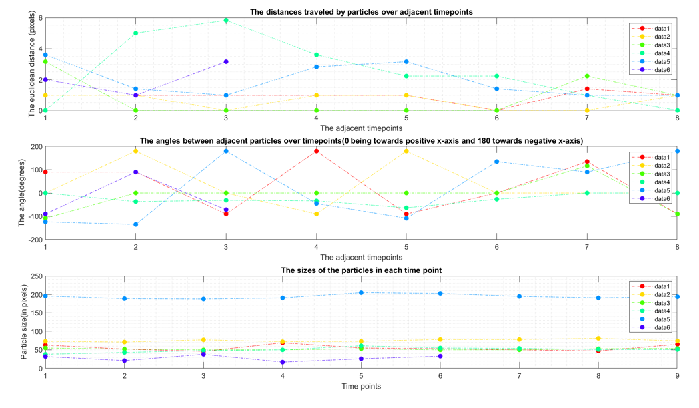
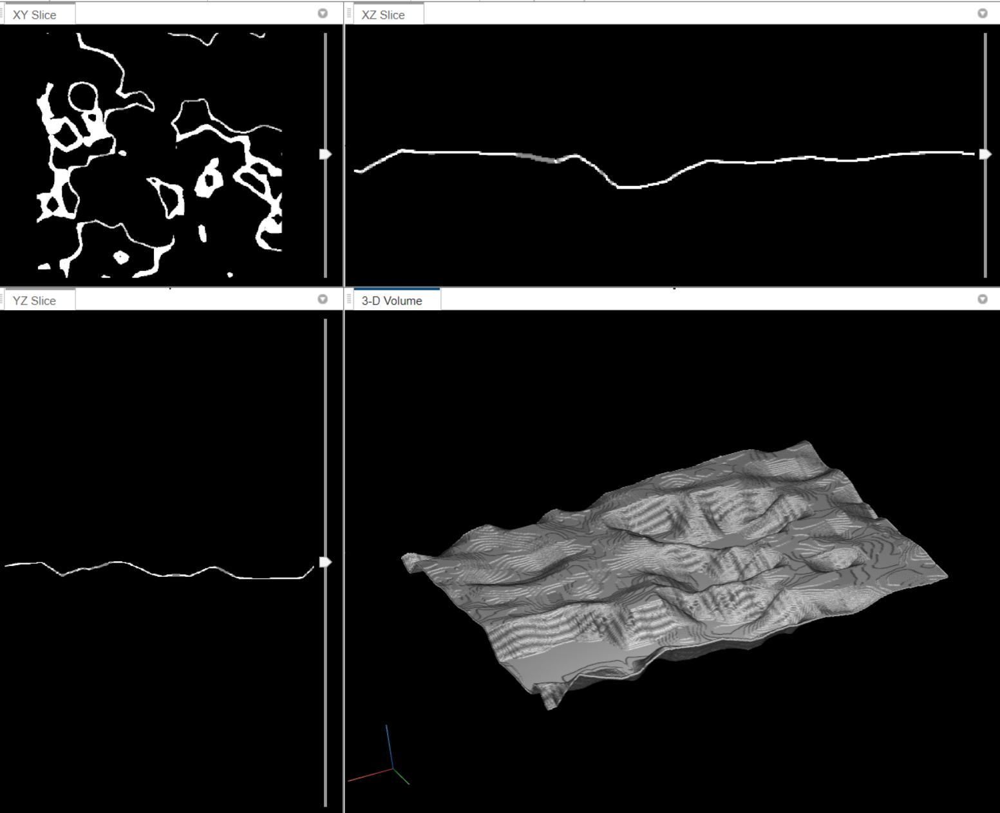
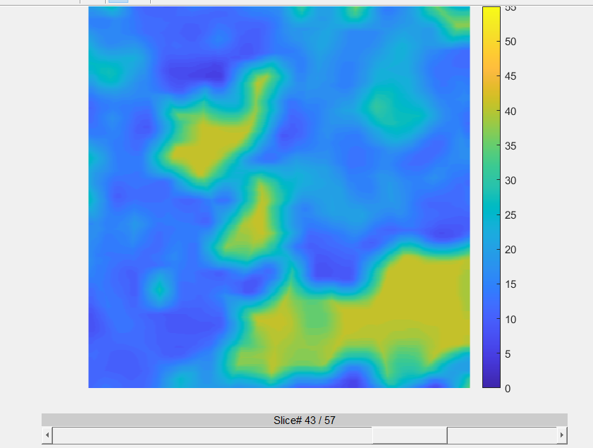

# microscopy-image-tools  👁️🦠🔬🥼👩‍💻

Here you can find overall explanations of the tools in microscopy-image-tools repository, more specific explanation of used methods and code can be found from the files. The tools are combinations of algorithms (developed by professionals) I found suitable for the purpose and algorithms made by me.

The bfmatlab folder contains a MATLAB package which is needed for opening and reading the microscopy files, all tools use this package.

The startup.m file needs to be moved to the MATLAB root folder, since its sole purpose is to add the files used by the tools into the MATLAB path so the user doesn't need to worry about that. Startup.m is then run every time the user starts MATLAB and thus the files are always on the path i.e. MATLAB can run them when they are needed.

## 2DparticleTrack version 2.1

**General comments:**

    -2DparticleTrack folder contains 2 dimensional particle tracking algorithm for microscopy image series i.e. 2D particle tracking in time dimension. 

    -THE ONLY FILE WHICH NEEDS TO BE RUN IS twoDparticleTracking.m, other files only need to be on the MATLAB path. 

**Adjustable parameters in the tool by files:**

_twoDparticleTracking.m_

* Channel which is extracted 

* Timepoints which are extracted

* Intensity threshold

_automatic_particle_tracking.m_

* max linking distance of adjacent tracking points (row 30)

* false can be turned into true --> shows clustering for each timepoint done by dbscan clustering algorithm (row 44 inside the function call)

* foldername (row 122)

_dbscan_clustering.m_

* eps i.e. the epsilon value of dbscan clustering alorithm, determines the distance for the neighbors from the calculated point

* minpts, minimum points, which need to be inside the distance determined by eps for the "point cloud" to be defined as a cluster 

### Example outputs

## 3DsurfaceMapping

**General comments:**

    -3DsurfaceMapping folder contains 3D dimensional surface mapping of the apical side of the cell surface.

    -THE ONLY FILE WHICH NEEDS TO BE RUN IS apical_surface_to_tif_output.m, other files only need to be on the MATLAB path.

**Adjustable parameters in the tool by files:**

_apical_surface_to_tif_output.m_

* isovalue on the row 32, it defines where the threshold is for "segmenting" the cell surface. 

### Example outputs

**LICENSE: See license.txt file**